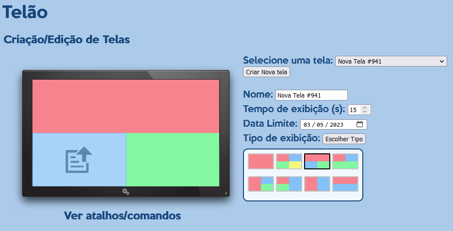
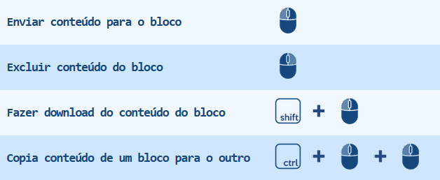

# telao-viewer
 Mostra de 1 a 4 telas em um monitor 4K
 Se quiser que mostrem em um monitor FullHD, só colocar o zoom em 50%

 ⚠️ **Atenção**: Códido legado de 10 anos atrás. *Não* contém boas práticas.

## Screenshots

### Criação de Telas

  

### Atalhos

  

## Como instalar
1. Baixar/clonar este repositorio e colocar os arqivos na pasta publica do servidor (ex.: /var/www/html)
    i. O servidor web precisa estar com PHP instalado
2. Instalar ffmpeg no sistema (completo, com ffprobe)
3. Criar base de dados, usuário e senha
4. Importar arquivo telao.sql para que as tabelas necessárias sejam criadas
5. Editar o arquivo `admin/config.php` com os dados criados